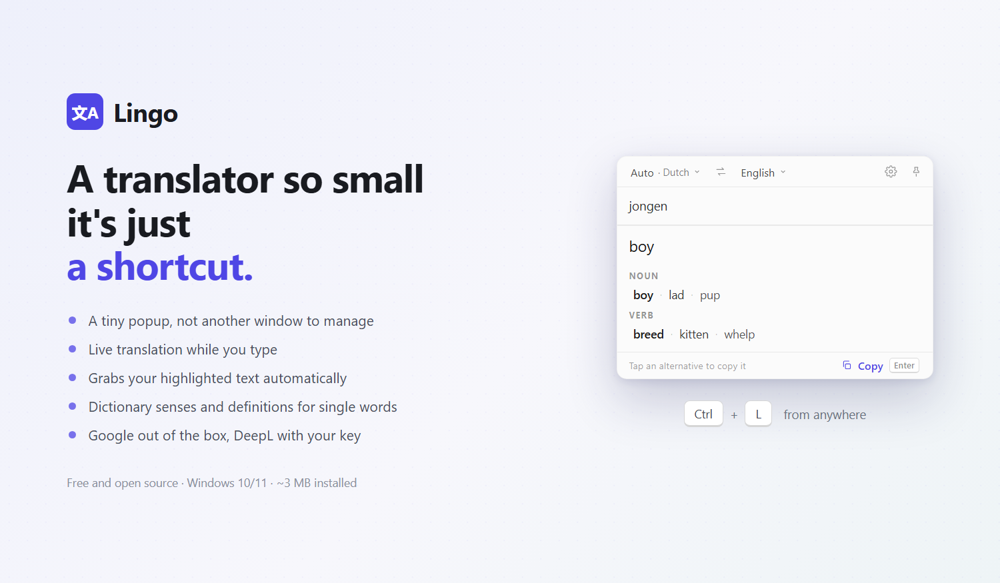

# Lingo

Minimalist translation popup for Windows - one shortcut, instant answer,
out of your way.



Lingo lives in the system tray. A global hotkey (default `Ctrl+L`,
remappable) opens a small always-on-top popup centered on your screen: text
highlighted in the active app is captured and translated immediately,
otherwise it translates live as you type. Single words additionally get
dictionary data - alternative translations grouped by part of speech, with
short definitions. No account, no telemetry, no clutter.

## Features

- **One hotkey, any app** - selection capture with a hard 300ms budget; on
  timeout the popup opens empty instead of lagging
- **Live translation while typing** - 400ms debounce, in-flight requests
  cancelled in Rust, stale results dropped by request id in the UI
- **Dictionary for single words** - senses grouped by part of speech, ranked
  by frequency with the long tail trimmed; definitions for English words
- **Auto language detection** - the detected language shows in the source
  chip; the target never changes unless you change it
- **RTL done right** - Hebrew and other right-to-left scripts render per
  pane; the popup chrome never flips
- **Quick actions** - `Enter` copies the translation and dismisses,
  `Shift+Enter` inserts a newline, `Esc` hides, tap any dictionary
  alternative to copy it, pin the popup to survive focus loss
- **Providers** - Google out of the box (no key), DeepL with your own key,
  switchable mid-session
- **Personal** - light/dark theme (follows Windows until you choose), accent
  color, ordered language list, launch at startup
- **Tiny** - ~2.6 MB installer. Built with Tauri on the WebView2 runtime
  Windows already ships, not a bundled browser

> **Provider note.** Lingo is not affiliated with or endorsed by Google or
> DeepL. The built-in Google provider talks to an unofficial, undocumented
> endpoint (the one Google's own web translator uses); it may change, get
> rate-limited, or stop working at any time, and using it may not comply
> with Google's Terms of Service. For a guaranteed, sanctioned service, use
> the DeepL provider with your own API key.

## Install

Download the installer from the [latest release](../../releases/latest) and
run it. It installs per-user (no admin needed), adds a Start Menu entry, and
uninstalls from **Settings → Apps** like any program.

> The installer isn't code-signed, so Windows SmartScreen may warn on first
> run - click **More info → Run anyway**.

## Development

Prerequisites: Node.js 20+, a Rust toolchain (MSVC), and the WebView2
runtime (preinstalled on Windows 11).

```sh
npm install
npm run tauri dev      # run from source (first run compiles Rust)
```

Config is stored via tauri-plugin-store under the app's data directory
(`config.json`); delete it to reset to defaults.

### Scripts

| Script | What it does |
| --- | --- |
| `npm run tauri dev` | Run the app from source |
| `npm run dist` | Build the installer into `src-tauri/target/release/bundle/nsis/` |
| `npm test` | Frontend unit tests (vitest) |
| `cargo test` (in `src-tauri/`) | Rust tests, including fixture-based parser tests |
| `npm run promo` | Re-render `promo.png` from `promo/promo.html` (headless Edge) |

### Structure

```text
src/            Solid frontend: popup window, settings window, typed IPC
src-tauri/      Rust backend: tray, hotkey, capture, providers, config
src-tauri/fixtures/  recorded Google endpoint responses for parser tests
promo/          static promo card (source of promo.png)
docs/           landing page (GitHub Pages)
design/         original design mockups
tools/          promo capture
```

### Architecture notes

Strict one-way data flow: the frontend sends intents as Tauri commands
(`translate`, `update_config`, `pin_toggle`, ...) and renders broadcast
events (`translation:result`, `config:changed`, `popup:show`, ...). Rust
owns all state: config, popup session, request lifecycle, and the dictionary
heuristic. Providers implement one trait (`TranslationProvider`) and are
swappable per request. The unofficial Google endpoint parser is tested
exclusively against recorded responses in `src-tauri/fixtures/google/`;
tests never hit the network.
